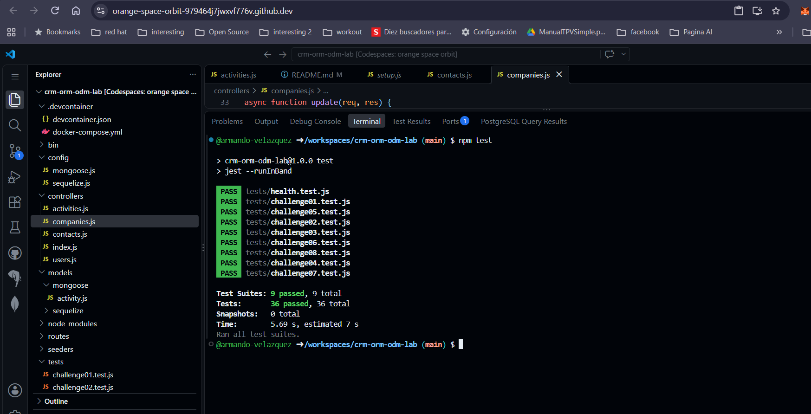

# CRM ORM/ODM Lab

API REST de un CRM básico que combina un ORM (Sequelize + PostgreSQL) y un ODM (Mongoose + MongoDB).

## Stack

- Node.js 22, Express 5, CommonJS
- Sequelize + PostgreSQL 16 (`User`, `Company`, `Contact`)
- Mongoose + MongoDB 7 (`Activity`)
- Jest + Supertest
- GitHub Codespaces, Dev Containers, Docker Compose
- Supervisor (`npm run dev`)

## Arquitectura

```text
GitHub Codespace
│
├── app       Node.js 22  ──┬── Sequelize ──> postgres (PostgreSQL)
│                           └── Mongoose  ──> mongo    (MongoDB)
├── postgres
└── mongo
```

La aplicación se conecta por nombre de servicio (`postgres`, `mongo`). Las credenciales de desarrollo llegan como variables de entorno definidas en `.devcontainer/docker-compose.yml` (ver `.env.example`).

## Iniciar el Codespace

1. En GitHub: **Code → Codespaces → Create codespace on main**.
2. Espera a que se levanten los tres servicios (`app`, `postgres`, `mongo`). `postCreateCommand` ejecuta `npm install`.

## Instalar dependencias

```bash
npm install
```

## Seed y reset

```bash
npm run seed    # inserta datos deterministas (3 users, 4 companies, 8 contacts, 10 activities)
npm run reset   # elimina y recrea tablas/base de datos y vuelve a sembrar
```

## Iniciar la API

```bash
npm start       # node ./bin/www
npm run dev     # supervisor ./bin/www
```

Servidor en el puerto `3000` (variable `PORT`).

## Pruebas

```bash
npm test
```

Cada suite restablece PostgreSQL y MongoDB antes de ejecutarse y cierra las conexiones al terminar.

## Endpoints

| Método | Ruta | Descripción |
|---|---|---|
| GET | `/health` | Health check |
| GET | `/users` | Listar usuarios |
| GET | `/users/:id` | Obtener usuario |
| POST | `/users` | Crear usuario |
| PUT | `/users/:id` | Actualizar usuario |
| DELETE | `/users/:id` | Eliminar usuario |
| GET | `/companies` | Listar compañías (`?industry=`) |
| GET | `/companies/:id` | Obtener compañía |
| POST | `/companies` | Crear compañía |
| PUT | `/companies/:id` | Actualizar compañía |
| DELETE | `/companies/:id` | Eliminar compañía |
| GET | `/contacts` | Listar contactos |
| GET | `/contacts/:id` | Obtener contacto |
| POST | `/contacts` | Crear contacto |
| PUT | `/contacts/:id` | Actualizar contacto |
| DELETE | `/contacts/:id` | Eliminar contacto |
| GET | `/activities` | Listar actividades (`?type=`) |
| GET | `/activities/:id` | Obtener actividad |
| POST | `/activities` | Crear actividad |
| PUT | `/activities/:id` | Actualizar actividad |
| DELETE | `/activities/:id` | Eliminar actividad |

Los errores se devuelven como JSON: `{ "error": "Contact not found" }`.

##respuestas
1 Dos motores
por que activity es constante cambio y maneja una estructura especifica de metadata y contact y Company no cambia muy seguido
y existe una relacion explicita entre company y contact

2.- ORM vs ODM
son un intermediario de comunicacion entre la aplicación y la base de datos, facilita la creación de tablas relaciones y documentos, la diferencia yace en la base de dato que manejan que una es para una BD SQL y otro para noSQL basado en documentos

3.- Configuracion
las contraseña están definidas en .devcontainer/docker-compose.yml en la sección enviroment
y no se escriben en el codigo por razones de seguridad
DB_HOST ;  postgress
MONGODB_URI; mongodb://mongo:27017/crm
por que las bases de datos están en otros contenedores

4.-Asociaciones 
company tiene muchos, 1 a N contacts,
llave foranea : companyID
as.- le da un nombre a la relacion para despues poder hacer referencia a ella

5.- Eager loading
pues facilita el codigo, y tiempo ,ya que se hace un join interno pero eso lo hace del DBMS sin tener que hacer 2 consultas 

6.- Instancia vs consulta
cuando se usa updates en contacts.js primero se busca el contacto nos permite replicar que no existe si no lo encontramos si, si esta  , permite devover sus datos actualizados, en el segund caso no se busca y solo tenemos la cantidad de filas que afectamos

7.-Esquema Flexible
se utiliza el tipo mongoose.Schema.Types.Mixed y lo que permite es guardar distintas estructuras , pero pueden llegar a guardarse datos inconsistentes ya que no valida automaticamente los tipos

8.-Sin Ref
pues el problema es que pertenecen a diferentes tipos de DB , y no hay relacion directa si se borra en uno no es por default que de borre en el otro, la aplicacion tiene que asegurar  que esto suceda

9.- Documento Actualizado
Agregue new:true, para que devolviera el registro actualizado run validators para verificar los cambios

10.-Pruebas de comportamiento
probar el comportamiento nos permite verificar que nuestra logica funciono,y que no depende de como lo hicimos,y si es necesario el cambiar el como se hizo la logica debe ser la misma para obtener el resultado esperado

11.- En tests/setup.js, beforeAll conecta Sequelize y Mongoose y ejecuta reset() para restablecer los datos iniciales antes de cada suite. Al terminar, afterAll cierra ambas conexiones. Así cada suite empieza con datos conocidos, sin depender de los cambios de pruebas anteriores, y se liberan las conexiones al finalizar.

12.- la verdad estuvo muy bien guiada la practica, donde batalle fue en el 5 jaja pero por que no escribi bien include, no me marco error solo no funcionaba seguia vacio ,esos errores son dificiles de encontrar y solo con practica creo que mejoras

## Evidencia


